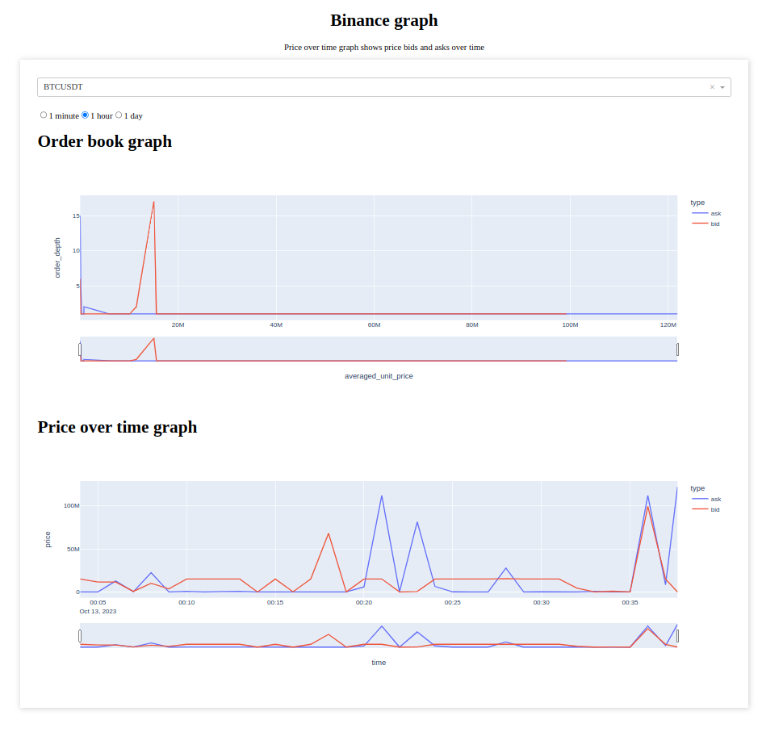

# Використані бібліотеки/технології 
## python-binance
Вибір зупинився на ній через значний функціонал для роботи з multiplexed socket, 
що дозволило робити підписку на оновлення багатьох binance символів. 
Використовується біблітека версії 1.0.13, оскільки в ній відсутній баг, котрий спричинює помилку `Queue overflow. Message not filled`. 
## База даних InfluxDB
В якості cховища даних була використано InfluxDB. InfluxDB - це база даних часових рядів, 
котра часто використовується для зберігання фінансових данних. Вона дозволяє робити вибірку данних вказуючи розмір проміжків часу
в яких дані будуть агреговані (групування по даті). Крім того в подальшому для прорідження данних можна задати Retention policies.

## Інструкція
Після скачування репозиторію необхідно виконати слідуючі команди:
- `make init` ця команда збілдить influx контейнер і зробить первинне налаштування, 
  що створить папку `./.local/influxdb2` в корені проекту
- `make up`

> При повторному виконанні `make init`, можлива помилка `rm: cannot remove '.local/influxdb2': Permission denied`,
> щоб її виправити потрібно видалити `.local/influxdb2` з `sudo`. Повторне виконання `make init` видаляє контейнер бази даних.

Перейшовши за посиланням http://localhost:8050/ можна побачити такий дашборд:

На дашборді є можливість вибирати потрібний binance символ, а також задати проміжок часу за який потрібно переглянути дані.

- Order book depth graph показує залежність між ціною за юніт криптовалюти та кількістю запитів/пропозицій по такій ціні (ціни усереднені у проміжка кроком 100000)
- Price over time graph просто показує запити/пропозиції як вони надходили по часу

Щоб увійти до адмінки InfluxDB потрібно перейти за посиланням http://localhost:8086/ та ввести логін `user` та пароль `password`. 

# Розширення функціоналу
У завданні згадувалось про збір історичних даних. Даний скрипт було розроблено для збору свіжих даних і збереженні їх у базу даних.
Якщо потрібно зібрати дані з інших ендпоінтів та зберегти їх у базу (в той самий measurement чи інший), 
треба розширити `BinanceDataProcessor` добавивши більше стрімів на які слід підписатись і функціонал який буде хендлити дані з цих стрімів.

# Тестування скрипта
Тестування проводилось на Linux. В Докер та на локальній машині використовувався Python3.9, щоб уникнути проблеми з встановленням asyncio.